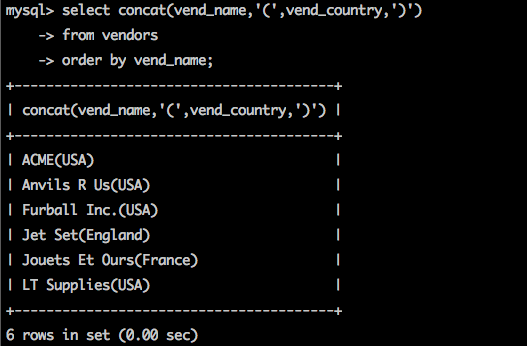
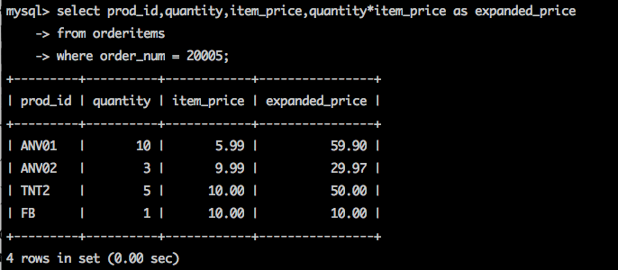
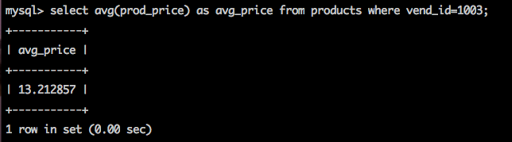
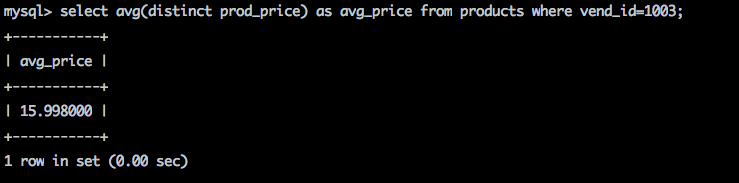
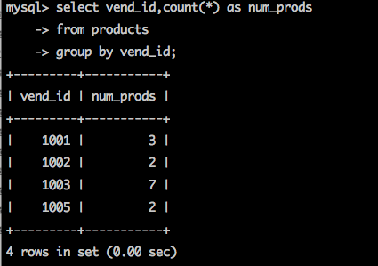
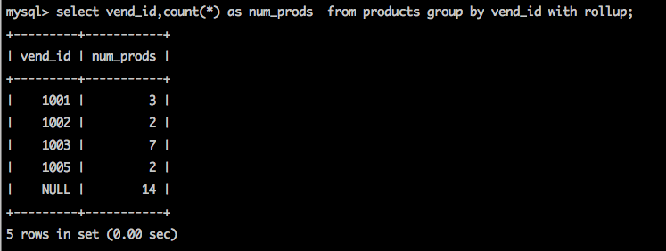
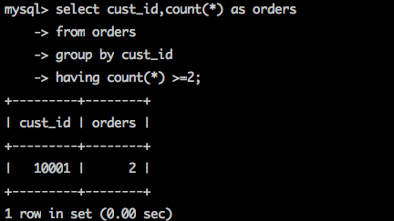
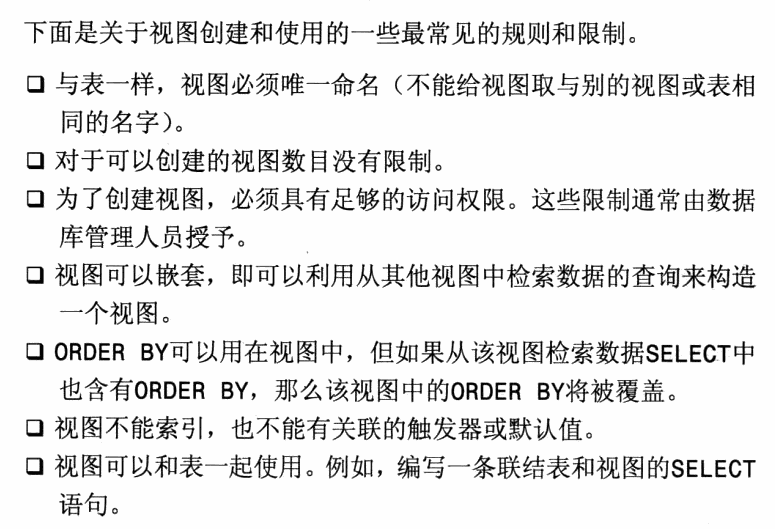

##MySQL

> 顺序问题：
> from --> where --> group by --> having --> order by -->  limit


+ 显示所有的数据库

```sql
show databases;
```


+ 使用指定的数据库

```sql
use |数据库名|;
```

+ 进入到指定的数据库，可以显示该数据库中所有的表

```sql
show tables;
```

+ 显示某个表中的所有字段信息

```sql
show columns from |表名|;
or
describe |表名|;
```

+ 显示创建特定数据库或者表的MySQL语句

```sql
show create database |数据库名|;
show create table |表名|;
```

+ 显示授予用户的权限

```sql
show grants
```

+ 导入sql文件

```sql
source |路径|
```

+ 取消重复行:如果指定多个列，则只有当多个列组合起来的这个组合不同时，才会起作用，也就是说distinct针对的是全部你选择的列且必须放到列名的最前面

```sql
select distinct |列名| from |表名|;
```

+ 限制输出limit：mysql默认是第0行；带一个参数：最多输出几行；带两个参数：从第一个参数开始，最多输出第二参数行

```sql
select prod_name from products limit 5; "最多输出5行
select prod_name from products limit 5,5;  "从行5开始的5行

```

+ 排序数据:order by :如果按照多列进行排序，则执行顺序：先按照第一个列排，如果第一列相同，则按第二列排;如果要升序排列某个字段，则在order by 后面的列名后加asc（但是默认的排序就是升序的，所以没啥用），如果要降序排列某个字段，则在order by 后面的列名后加desc

```sql
select |列名|,|列名|... from |表名| order by |列名|,|列名|... ;
```

+ order by 和 limit组合可以选中最大的或者最小的一行

```sql
select prod_price from products order by prod_price desc limit 1; "选中最高价格的一行
```


###过滤数据

+ where子句操作符

|操作符|说明|  
|------|---|
|=|等于|
|<>|不等于|
|!=|不等于|
|<|小于|
|<=|小于等于|
|>|大于|
|>=|大于等于|
|between A and B|在指定的两个值之间,包括开始值和结束值|
|is NULL|不具有该字段的值，就是没写|


+ 连接个where子句

|操作符|说明|  
|------|---|
|AND|且，优先级最高（括号除外），即先过滤该条件|
|OR |或者|
|IN|条件范围，和or一样，但是比or快,最大的优点是可以包含其他select语句|
|NOT| 只可以对IN Between exists子句取反|

```sql
select prod_name,prod_price 
from products
where vend_id = 1002 or vend_id =1003 and prod_price >=10;
"供应商1003制造的价格在10元之上的商品或者供应商编号是1002的所有商品 即where vend_id = 1002 or （vend_id =1003 and prod_price >=10）;

"供应商1002或1003制造的且价格都在10元之上的商品
select prod_name,prod_price 
from products
where (vend_id = 1002 or vend_id =1003) and prod_price >=10;
```

+ 通配符过滤：不到万不得已不要使用

	+ 通配符：比其他搜索要慢，放在过滤的最开始，搜索起来是最慢的
	
	|通配符|说明|
	|-----|---|
	|%|任意字符出现任意次数，但不能匹配NULL|
	|_|单个字符|

```sql
select prod_id,prod_name from products where prod_name like '_ ton anvil';

select prod_id,prod_name from products where prod_name like '% ton anvil';
"会匹配到这样一条数据： .5 ton anvil
```
	
+ 正则过滤 regexp

	
	+ like和regexp的最大差别在于：like匹配整个列，如果匹配的文本在列值中出现，like将不会找到它，也就不会返回相应的行，而regexp则会
	
	```sql
	select prod_name from products where  prod_name like '1000' order by prod_name;"没有数据
	
	select prod_name from products where  prod_name regexp '1000' order by prod_name;"会出现1000的一条数据
	```
	
	+ 匹配区分大小写，mysql中的正则是不匹配大小写的，但是可以指定区分大小写，eg: where prod_name regexp binary 'JetPack .000';


|通配符|说明|
|-------|---|
|.|一个字符|
|*|随便|
|+|至少有一个|
|？|最多有一个|
|^|文本的开始|
|$|文本的结尾|
|{n}|指定数目的匹配|
|{n,}|大于指定数目的匹配|
|{n,m}|匹配数目的范围|
|\||OR|
|[123]|另一种or，匹配1\|2\|3|
|[^123]|除了这些字符外的任何东西|
|[0-9]|0到9|
|[a-z]|任意字母字符|
|双反斜杠|前导：将特殊字符匹配，MySQL自己解释一个，正则解释一个，所以用两个反斜杠|
|[:alnum:]|任意字母和数字|
|[:alpha:]|任意字符和[a-zA-Z]一样|
|[:blank:]|空格和制表|
|[:upper:]|任意大写字母|


##计算字段

+ 拼接字段 Concat()

```sql
select concat(vend_name,'(',vend_country,')') 
from vendors
order by vend_name;
```

[]()

+ 另一个常用：对检索出来的数据进行算术计算

```sql
select prod_id,quantity,item_price,quantity*item_price as expanded_price
from orderitems
where order_num = 2005;
```

[]()	

##处理数据

|函数名|作用|
|----|----|
|RTrim()|去除列值右边的空格|
|Upper()|转换成大写|
|AVG()|返回某列的平均值,忽略null值的行|
|COUNT()|返回某列的行数,count(*)包括null，count(column)则不包括null|
|MAX()|返回某列的最大值,忽略null值的行|
|MIN()|返回某列的最小值,忽略null值的行|
|SUM()|返回某列值之和,忽略null值的行|
|IFNULL(A，B)|如果A返回空，则将结果设置为B|


```sql
select avg(prod_price) as avg_price
from products 
where vend_id =1003;
```

[]()	
```sql
select avg(distinct prod_price) as avg_price 
from products
where vend_id = 1003;
```
[]()	


+ group by 子句

```sql
select vend_id,count(*) as num_prods 
from products
group by vend_id;
"group by 子句指示MySQL按vend_id进行排序并分组数据
“规定：group by 中出现的列 必须在select中出现
“如果分组列中出现null值，则null作为一个分组返回
```

[]()	

+ with rollup

```sql
select vend_id,count(*) as num_prods 
from products
group by vend_id with rollup;

```
[]()	


+ 过滤分组

```sql
select cust_id,count(*) as orders
from orders
group by cust_id
having count(*) >=2;
"对于分组之后的数据再进行过滤,而where在分组之前进行过滤
```
[]()	


##数据增删改

+ 插入多条数据

```sql
insert into customers(
	cust_name,cust_address,cust_city,
	cust_state,cust_zip,cust_country)
values(
	'Pep E. LaPew',
	'100 main street',
	'Los Angeles',
	'CA',
	'90046',
	'USA'
	),
	(
	'Pep2 E. LaPew',
	'1002 main street',
	'Los2 Angeles',
	'CA2',
	'900462',
	'USA'
	);
"这样的插入多条数据比多条insert效率要高
```

+ 插入检索出来的数据:复制表的数据到另一个表中

```sql
insert into customers(
	cust_name,cust_address,cust_city,
	cust_state,cust_zip,cust_country
	)
select 
	cust_name,cust_address,cust_city,
	cust_state,cust_zip,cust_country
from custnew;
	
```

+ 更新数据

```sql
update customers 
set cust_email = 'example@qq.com',
set cust_name = 'The Fudds',
set cust_xxx = null "设置某个值为空就是删除该列的值
where cust_id = 10005; “
```

+ 删除数据

```sql
delete from customers
where cust_id = 10006;"如果没有where语句 ，则删除表中的所有行，但没有删除表

“更快的删除表中所有行 实际上是删除了原来的表并重新创建一个表
truncate table 表名;
```

##数据引擎
> 使用ENGINE=引擎名 创建表的时候

|引擎| 说明|
|----|----|
|InnoDB| 可靠的事务处理引擎|
|MEMORY|数据存储在内存，速度很快|
|MyISAM|性能极高的引擎，支持全文本搜素，但不支持事务处理|


##更新表

+ 添加列

```sql
alter table vendors
add vend_phone char(20);
```


+ 删除列

```sql
alter table vendors
drop column vend_phone;
```
+ 常用：定义外健

```sql
alter table orderitems
add constrain fk_orderitems_orders
foreign key(order_num) reference orders (order_num);
```

##删除表

+ 删除表

```sql
drop table customers2;
```

+ 重命名表

```sql
rename table customers2 to customers,
				backup_vendors to vendors,
				bakcup_products to products;
```


##视图

> 视图的作用：
> 举个例子：要用查询来检索订购某个产品的客户，任何需要这个数据的人都必须理解相关表的结构，并且知道如何创建查询和对表进行联结。
> 为了检索其他产品的相同数据，必须修改最后的where子句。
> 那么，现在假如可以把整个查询包装成一个名为productcustomer的虚拟表，则可以如下轻松的检索出相同的数据

+ 作用：
	+ 重用sql语句
	+ 简化复杂的sql操作，编写查询后，可以方便的重用它而不必知道它的基本查询细节
	+ 使用表的组成部分而不是整个表
	+ 保护数据，可以给用户授予表的特定部分的访问权限而不是整个表的访问权限
	+ 更改数据格式和表示。视图可以返回与底层表的表示和格式不同的数据

+ 视图的限制
+ 
[]()	


```sql
--把table 换成view

```

+ 视图更新的限制：如果视图定义中有以下操作：
	+ 分组
	+ 联结
	+ 子查询
	+ 并
	+ 聚集函数
	+ distinct
	+ 导出（计算）列
