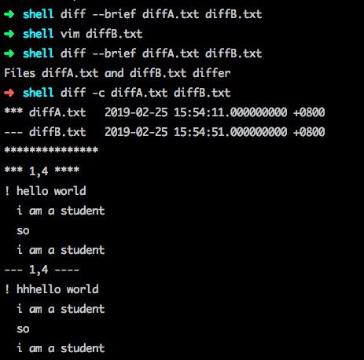
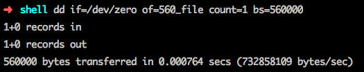
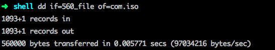
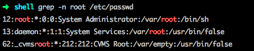

##常用命令


zsh作为终端添加环境变量

```shell
vim ~.zshrc

export PATH=${PATH}:/usr/local/mysql/bin
wq

source ~.zshrc
```

设置截图保存路径

```shell
defaults write com.apple.screencapture location 路径
```


五种进程名称：
R 运行
S 中断 休眠
D 不可中断
Z 僵死
T 停止

 ps aux
 tail -f 用于查看最新的日志文件
 
 cat /etc/passwd | cut -d : -f 1
 -d 指定分隔符: -f field指定想要显示的第几个字段
 passwd:
 root:*:0:0:System Administrator:/var/root:/bin/sh
 1    2 3 4 5                    6         7
 
 diff --brief 比较两个文件内容是否一样 一样不输出 不一样会输出differ
 diff -c diffA.txt diffB.txt 显示不同的地方
 []()
 
 dd 用来复制文件 或者 制作iso文件
 dd if=/dev/zero of=560_file count=1 bs=560000
  []()
  []()
  
  
  file 查看文件类型
  []()
  []()
  []()


tar -czvf file.tar.gz file
打包成压缩包
tar -xzvf file.tar.gz -C 要存放的路径
解压

grep 在文件中查找
-n 表示 显示关键字出现的行号
-v 表示 显示关键字没出现的行号
  []()

find 在某个目录下查找

[]()
