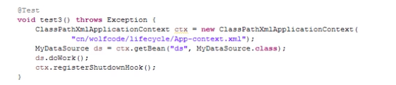
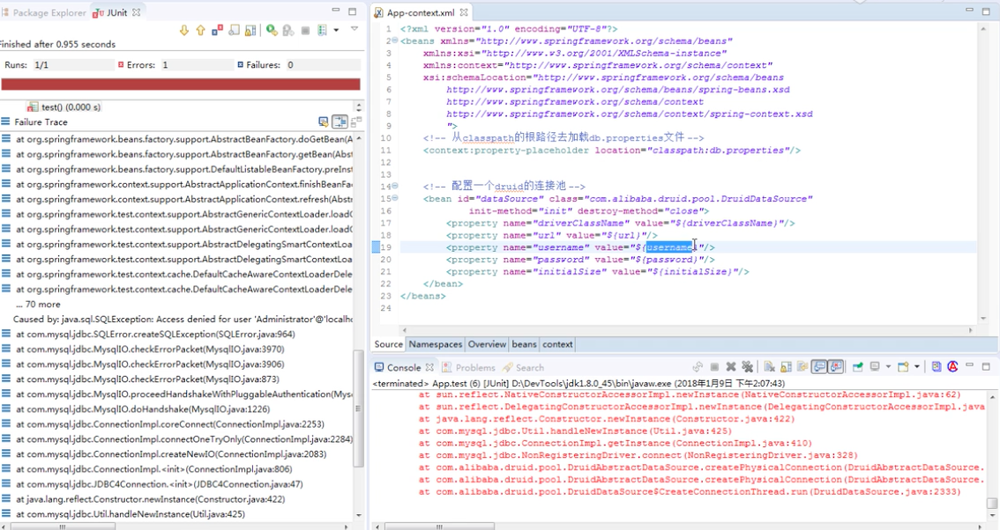
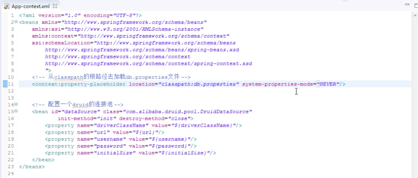
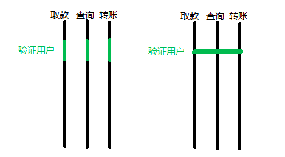
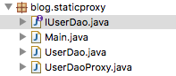
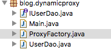
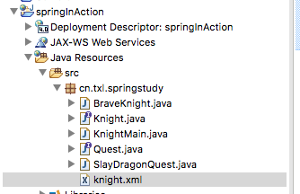

##Spring
+ spring xml配置文件的头

```java
<?xml version="1.0" encoding="UTF-8"?>
<beans xmlns="http://www.springframework.org/schema/beans"
  xmlns:xsi="http://www.w3.org/2001/XMLSchema-instance"
  xmlns:context="http://www.springframework.org/schema/context"
  xmlns:c="http://www.springframework.org/schema/c"
  xsi:schemaLocation="http://www.springframework.org/schema/beans 
  http://www.springframework.org/schema/context
  http://www.springframework.org/schema/context/spring-context.xsd
  http://www.springframework.org/schema/beans/spring-beans.xsd">

</beans>
```

+ pom.xml

```java

<project xmlns="http://maven.apache.org/POM/4.0.0"
	xmlns:xsi="http://www.w3.org/2001/XMLSchema-instance"
	xsi:schemaLocation="http://maven.apache.org/POM/4.0.0 http://maven.apache.org/xsd/maven-4.0.0.xsd">
	<modelVersion>4.0.0</modelVersion>
	<groupId>cn.txl.myjar</groupId>
	<artifactId>hello</artifactId>
	<version>0.0.1-SNAPSHOT</version>
	<dependencies>
		<!-- https://mvnrepository.com/artifact/org.springframework/spring-context -->
		<dependency>
			<groupId>org.springframework</groupId>
			<artifactId>spring-context</artifactId>
			<version>4.3.20.RELEASE</version>
		</dependency>
<!-- https://mvnrepository.com/artifact/commons-logging/commons-logging -->
<dependency>
    <groupId>commons-logging</groupId>
    <artifactId>commons-logging</artifactId>
    <version>1.2</version>
</dependency>
<!-- https://mvnrepository.com/artifact/junit/junit -->
<dependency>
    <groupId>junit</groupId>
    <artifactId>junit</artifactId>
    <version>4.12</version>
    <scope>test</scope>
</dependency>


<!-- https://mvnrepository.com/artifact/org.springframework/spring-test -->
<dependency>
    <groupId>org.springframework</groupId>
    <artifactId>spring-test</artifactId>
    <version>4.3.20.RELEASE</version>
    <scope>test</scope>
</dependency>
<dependency>
  <groupId>com.github.stefanbirkner</groupId>
  <artifactId>system-rules</artifactId>
  <version>1.19.0</version>
  <scope>test</scope>
</dependency>
<!-- https://mvnrepository.com/artifact/org.hamcrest/hamcrest-core -->
<dependency>
    <groupId>org.hamcrest</groupId>
    <artifactId>hamcrest-core</artifactId>
    <version>1.3</version>
    <scope>test</scope>
</dependency>

<!-- https://mvnrepository.com/artifact/org.hamcrest/hamcrest-library -->
<dependency>
    <groupId>org.hamcrest</groupId>
    <artifactId>hamcrest-library</artifactId>
    <version>1.3</version>
    <scope>test</scope>
</dependency>


<!-- https://mvnrepository.com/artifact/org.aspectj/aspectjrt -->
<dependency>
    <groupId>org.aspectj</groupId>
    <artifactId>aspectjrt</artifactId>
    <version>1.9.2</version>
</dependency>

<!-- https://mvnrepository.com/artifact/org.aspectj/aspectjweaver -->
<dependency>
    <groupId>org.aspectj</groupId>
    <artifactId>aspectjweaver</artifactId>
    <version>1.9.2</version>
</dependency>

<!-- https://mvnrepository.com/artifact/aopalliance/aopalliance -->
<dependency>
    <groupId>aopalliance</groupId>
    <artifactId>aopalliance</artifactId>
    <version>1.0</version>
</dependency>


	</dependencies>


</project>
```

+ 装配Bean的方式：
> 如何选择：
>> 首先使用自动装配
>> 有些源码不是由你来维护，而当你需要为这些代码配置bean的时候，使用JavaConfig
>> 最后，只有当你想要使用便利的xml命名空间，并且在JavaConfig中没有同样的实现时，才使用xml
	+ 自动装配
		+
	+ JavaConfig装配
	+ xml装配
不用框架的销毁：
[]()

常见的连接池错误：
[]()

配连接池的正确示例：
一般将连接的信息写在properties里面
[]()

注解说明

+ @ComponentScan //自动扫描CDPlayerConfig所在包下的组件Component
	+ @ComponentScan(basePackage="包名") 指定基础包
	+ @ComponentScan(basePackage={"包名1"，"包名1"}) 指定多个基础包
	+ @ComponentScan(baseClasses={CDPlayer.class,DVDPlayer.class}) 指定包中含有的类或者接口
+ @Component //声明是一个组件 spring会自动的创建一个bean
+ @Autowired //自动装配:根据类型找 如果找到多个 按照名称再找 默认是第一个字母小写的类名，
	+ @Autowired(required=false) 如果没有匹配的bean，那么在应用上下文创建的时候，Spring就会抛出一个异常，为了避免异常的出现，可以将属性required设置为false，但是需要谨慎对待，因为没有进行代码的null检查的话，就会让这个未装配的bean出现空指针异常
+ @Configuration 在类上声明，表明这个类是一个配置类，该类应该包含在应用上下文中如何创建bean的细节
+ @Bean(name="sgtpeppers") 为方法上声明 创建的bean的名字和方法同名 且是单例
+ @ContextConfiguration(classes = CDPlayerConfig.class) // 为CDPlayerTest加载配置
+ @Import(CDPlayerConfig.class) //引入带有@Configuration的java类。 配置在JavaConfig中的CDPlayer加载到spring容器中
+ @ImportResource(locations= {"cn/txl/springstudy/ch02/mix/config.xml"}) //配置在xml中的BlankDisc加载到spring容器中

##AOP
面向切面：在运行时，动态地将代码切入到类的指定方法，指定位置上的编程思想
AOP的本质是在一系列纵向的控制流程中，把那些相同的子流程提取成一个横向的面，这句话应该好理解吧，我们把纵向流程画成一条直线，然把相同的部分以绿色突出，如下图左，而AOP相当于把相同的地方连一条横线，如下图右，这个图没画好，大家明白意思就行。

[]()

spring 提供四种类型的AOP支持：构建在动态代理基础之上，因此Spring对AOP的支持局限于方法拦截
+ 基于代理的经典SpringAOP  --- 过时了
+ 纯POJO切面
+ @AspectJ注解驱动的切面
+ 注入式AspectJ切面

AOP原理：
+ 最开始：静态代理
[]()

> IUserDao

```java
package blog.staticproxy;

public interface IUserDao {
	public void save();
	public void find();
}

```


> UserDao

```java
package blog.staticproxy;
/**
 * 只关注业务逻辑 开启事务 提交事务 等等其他操作不用理会
 * @author taolun
 *
 */
public class UserDao implements IUserDao{

	public void save() {
		// TODO Auto-generated method stub
		System.out.println("模拟用户 保存数据");
	}

	public void find() {
		// TODO Auto-generated method stub
		System.out.println("模拟 查询用户");
	}

}


```

> UserDaoProxy

```java
package blog.staticproxy;
/**
 * 静态代理：所谓静态 其实就是编译时期已经确定
 * 特点：
 * 1. 目标对象必须要实现接口
 * 2. 代理对象，要实现与目标对象一样的接口
*/
public class UserDaoProxy implements IUserDao{
	private IUserDao  target = new UserDao();
	public void save() {
		System.out.println("代理操作:开启事务");
		target.save();
		System.out.println("代理操作：提交事务");
	}

	public void find() {
		// TODO Auto-generated method stub
		target.find();
	}

}

```

> Main

```java
package blog.staticproxy;

public class Main {
	public static void main(String[] args) {
		IUserDao proxy = new UserDaoProxy();
		/**
		 * 表面上调用的是业务逻辑的方法，实际上是调用代理类的方法
		 * 代理类做了事务之后，再执行业务逻辑的方法---一种增强
		 */
		proxy.save();
	}
		
}

```

+ 动态代理：jdk代理

[]()


>IUserDao and UserDao 和上面一样
>ProxyFactory

```java
package blog.dynamicproxy;

import java.lang.reflect.InvocationHandler;
import java.lang.reflect.Method;
import java.lang.reflect.Proxy;

public class ProxyFactory {
	private Object target;
	public ProxyFactory(Object target) {
		this.target=target;
	}
	public Object getProxyInstance() {
		Object proxy = Proxy.newProxyInstance(target.getClass().getClassLoader(),//目标对象的类加载器
				target.getClass().getInterfaces(), //目标对象的接口
				new InvocationHandler() {//匹配目标对象的哪个对象方法被调用
					public Object invoke(Object proxy, Method method, Object[] args) throws Throwable {
						String methodName = method.getName();
						Object result = null;
						if("find".equals(methodName)) {
							result = method.invoke(target, args);
						}else {//目标对象调用save()方法
							System.out.println("开启事务");
							result=method.invoke(target,args);//调用目标对象的save方法
							System.out.println("提交事务");
						}
						return result;
					}
				});
		return proxy;
	}
}

```

>Main

```java
package blog.dynamicproxy;
/**
 * Spring AOP的实现就是通过这两种动态代理实现的 
 * 如果一个类实现了接口，那么使用jdk代理
 * 如果一个类没有实现接口，且不被final修饰，则使用CGLIB代理
 * 如果一个类既没有实现接口，也被final修饰，那么AOP出现错误
 * @author taolun
 *
 */
public class Main {
	public static void main(String[] args) {
		IUserDao target = new UserDao();
		//使用jdk生成的动态代理的前提是目标类必须有实现的接口 如果一个类没有实现接口，就不能使用jdk动态代理
		//而CGLIB代理就是解决这个问题的：原理是通过继承动态生成子类继承目标的方法实现，在运行期动态的在内存中构建一个子类
		//所以CLGLIB代理的实现前提必须目标类不能被final修饰
		//JDK 动态生成了一个类去实现接口，隐藏了这个过程：
		//class $jdkProxy implements IUserDao{}
		IUserDao proxy = (IUserDao) new ProxyFactory(target).getProxyInstance();
		proxy.save();
	}
}


```


##ERROR
+ xml路径
```java
2月 23, 2019 5:39:50 下午 org.springframework.context.support.ClassPathXmlApplicationContext prepareRefresh
信息: Refreshing org.springframework.context.support.ClassPathXmlApplicationContext@21213b92: startup date [Sat Feb 23 17:39:50 CST 2019]; root of context hierarchy
2月 23, 2019 5:39:50 下午 org.springframework.beans.factory.xml.XmlBeanDefinitionReader loadBeanDefinitions
信息: Loading XML bean definitions from class path resource [resources/knight.xml]
Exception in thread "main" org.springframework.beans.factory.BeanDefinitionStoreException: IOException parsing XML document from class path resource [resources/knight.xml]; nested exception is java.io.FileNotFoundException: class path resource [resources/knight.xml] cannot be opened because it does not exist
	at org.springframework.beans.factory.xml.XmlBeanDefinitionReader.loadBeanDefinitions(XmlBeanDefinitionReader.java:344)
	at org.springframework.beans.factory.xml.XmlBeanDefinitionReader.loadBeanDefinitions(XmlBeanDefinitionReader.java:304)
	at org.springframework.beans.factory.support.AbstractBeanDefinitionReader.loadBeanDefinitions(AbstractBeanDefinitionReader.java:181)
	at org.springframework.beans.factory.support.AbstractBeanDefinitionReader.loadBeanDefinitions(AbstractBeanDefinitionReader.java:217)
	at org.springframework.beans.factory.support.AbstractBeanDefinitionReader.loadBeanDefinitions(AbstractBeanDefinitionReader.java:188)
	at org.springframework.beans.factory.support.AbstractBeanDefinitionReader.loadBeanDefinitions(AbstractBeanDefinitionReader.java:252)
	at org.springframework.context.support.AbstractXmlApplicationContext.loadBeanDefinitions(AbstractXmlApplicationContext.java:127)
	at org.springframework.context.support.AbstractXmlApplicationContext.loadBeanDefinitions(AbstractXmlApplicationContext.java:93)
	at org.springframework.context.support.AbstractRefreshableApplicationContext.refreshBeanFactory(AbstractRefreshableApplicationContext.java:129)
	at org.springframework.context.support.AbstractApplicationContext.obtainFreshBeanFactory(AbstractApplicationContext.java:614)
	at org.springframework.context.support.AbstractApplicationContext.refresh(AbstractApplicationContext.java:515)
	at org.springframework.context.support.ClassPathXmlApplicationContext.<init>(ClassPathXmlApplicationContext.java:139)
	at org.springframework.context.support.ClassPathXmlApplicationContext.<init>(ClassPathXmlApplicationContext.java:83)
	at cn.txl.spring.ch01.KnightMain.main(KnightMain.java:6)
Caused by: java.io.FileNotFoundException: class path resource [resources/knight.xml] cannot be opened because it does not exist
	at org.springframework.core.io.ClassPathResource.getInputStream(ClassPathResource.java:172)
	at org.springframework.beans.factory.xml.XmlBeanDefinitionReader.loadBeanDefinitions(XmlBeanDefinitionReader.java:330)
	... 13 more
```
+ 解决:classpath 默认是在src下
[]()
```java
ClassPathXmlApplicationContext context = new ClassPathXmlApplicationContext("cn/txl/springstudy/knight.xml");
```


