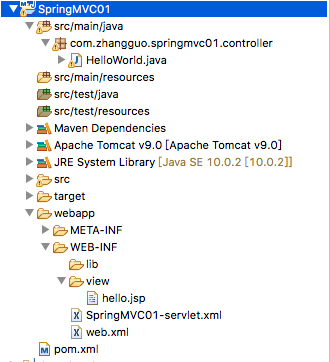

##Spring MVC

第一个例子
[]()

+ 项目名：创建maven项目的时候，有个Group id 对应的就是项目名
+ spring的配置文件名：项目名-servlet.xml 且要放在WEB-INF目录下
+ src/main/java:java文件目录

>spring的配置文件

```java

<?xml version="1.0" encoding="UTF-8"?>
<beans xmlns="http://www.springframework.org/schema/beans"
    xmlns:xsi="http://www.w3.org/2001/XMLSchema-instance" 
    xmlns:context="http://www.springframework.org/schema/context"
    xmlns:mvc="http://www.springframework.org/schema/mvc"
    xsi:schemaLocation="http://www.springframework.org/schema/beans 
         http://www.springframework.org/schema/beans/spring-beans.xsd
        http://www.springframework.org/schema/context 
        http://www.springframework.org/schema/context/spring-context-4.3.xsd
        http://www.springframework.org/schema/mvc 
        http://www.springframework.org/schema/mvc/spring-mvc-4.3.xsd">
    <!-- 自动扫描包，实现支持注解的IOC -->
    <context:component-scan base-package="com.zhangguo.springmvc01" />
    <!-- Spring MVC不处理静态资源 -->
    <mvc:default-servlet-handler />
    <!-- 支持mvc注解驱动 -->
    <mvc:annotation-driven />
    <!-- 配置url的访问的时候的地址栏输入的信息：去掉前缀和后缀 -->
  <bean
        class="org.springframework.web.servlet.view.InternalResourceViewResolver"
        id="internalResourceViewResolver">
        <!-- 默认的前缀就是/WEB-INF/view/ -->
        <property name="prefix" value="/WEB-INF/view/" />
        <!-- 默认的后缀名是jsp -->
        <property name="suffix" value=".jsp" />
    </bean>
</beans>
```

> web.xml配置文件

```java

<?xml version="1.0" encoding="UTF-8"?>
<web-app xmlns:xsi="http://www.w3.org/2001/XMLSchema-instance"
    xmlns="http://java.sun.com/xml/ns/javaee"
    xsi:schemaLocation="http://java.sun.com/xml/ns/javaee http://java.sun.com/xml/ns/javaee/web-app_3_0.xsd"
    id="WebApp_ID" version="3.0">

    <servlet>
        <servlet-name>SpringMVC01</servlet-name>
        <servlet-class>org.springframework.web.servlet.DispatcherServlet</servlet-class>
       <!--  <init-param>
            <param-name>contextConfigLocation</param-name>
            <param-value>classpath:springmvc-servlet.xml</param-value>
        </init-param> -->
        <load-on-startup>1</load-on-startup>
    </servlet>
	<!-- 两个servlet-mapping的servlet-name要一样 -->
    <servlet-mapping>
        <servlet-name>SpringMVC01</servlet-name>
        <!-- 拦截了请求 -->
        <url-pattern>/</url-pattern>
    </servlet-mapping>

</web-app> 
```


